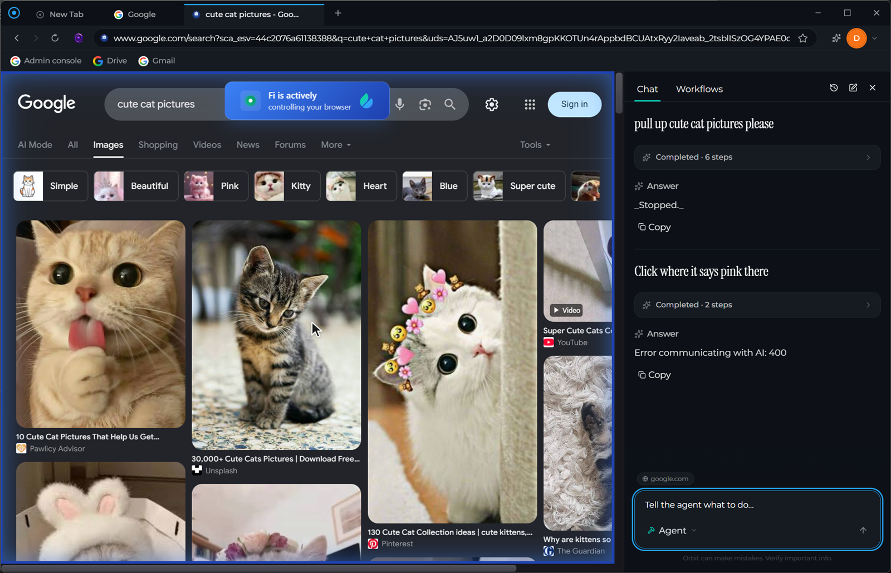
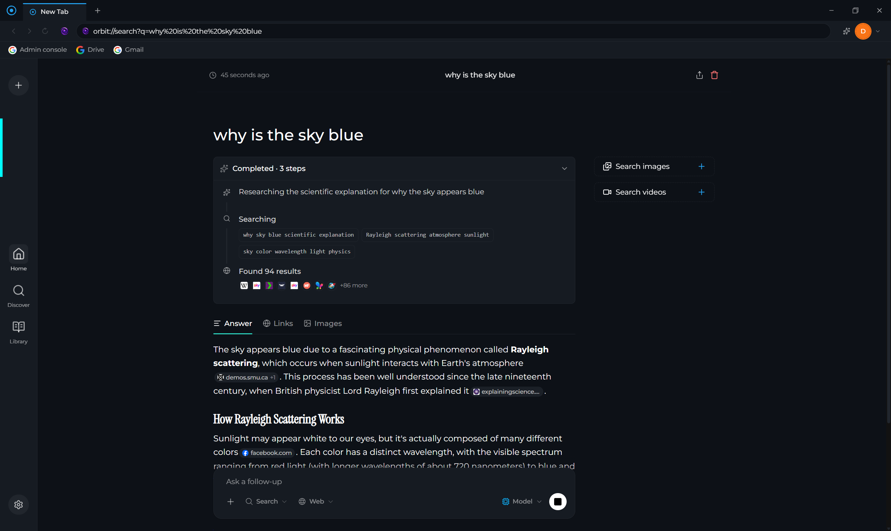
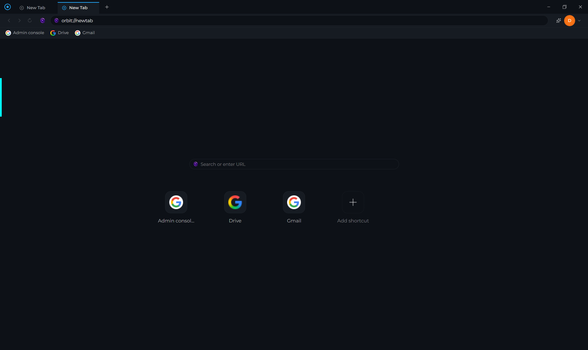

# Orbit

An AI-native desktop browser. Orbit is an Electron browser with Chrome-like tabs, a local
answer-engine as its search, and an assistant that can actually drive the page for you.



## What's in it

| | |
|---|---|
| **Agentic assistant** | A sidebar assistant with an `ask` mode for questions about the current page and an `agent` mode that clicks, types, scrolls and navigates real tabs on your behalf. Tool calls stream into a live timeline as they run. |
| **Local answer-engine search** | `orbit://search` is [Simplicity](https://github.com/Blueturboguy07/Simplicity) running on your machine against a local [SearXNG](https://github.com/searxng/searxng) instance — cited answers, not a results page. |
| **Chrome-like tabs** | Multiple tabs with drag-to-reorder and drag-out-to-detach into a new window. |
| **Profiles & Chrome import** | Import your Chrome profiles — bookmarks, history, cookies, preferences — during onboarding. |
| **Bookmarks** | Bookmarks bar, folder tree, drag-and-drop organisation, and a full manager at `orbit://bookmarks`. |
| **Smart omnibox** | Autocomplete over your history and visited sites, backed by SQLite. |

### Search

`orbit://search` runs a full answer engine locally — it plans sub-queries, retrieves through
SearXNG, reranks with a local embedding model, and streams back a cited answer.



### New tab



## Architecture

Orbit is an Electron shell that supervises three child processes:

```
┌─ Electron main ────────────────────────────────────────────┐
│  window + tab management, IPC, SQLite services             │
│  spawns ─┬─ Python backend (FastAPI)  ── the AI agent      │
│          ├─ Simplicity (Next.js)      ── search UI + API   │
│          └─ SearXNG (Python/Flask)    ── search retrieval  │
└────────────────────────────────────────────────────────────┘
```

A single `BrowserWindow` hosts several stacked `WebContentsView`s rather than one renderer:

```
tab views (one per open website)                    <- bottom
search view (orbit://search, the Simplicity server)
UI view      (transparent, full-window: header, nav, chrome)
sidebar view (the AI assistant, its own renderer)   <- top
```

The window's own root `webContents` deliberately holds a blank document. Every surface above is a
separate CDP page target, which is what lets the Python agent attach to real web pages while
ignoring Orbit's own interface.

### How the agent sees a page

The agent is built to work with small local models, so **elements are addressed by ref ID
(`e17`), never by x/y coordinates** — picking a label out of a labelled set degrades far better
than estimating a pixel position. Each turn it receives:

1. A **YAML snapshot** of the interactive elements intersecting the viewport, each with a ref ID.
2. A **1024×1024 letterboxed set-of-marks screenshot** — the same ref IDs painted onto the page
   as badges.

Both come out of a single `page.evaluate` pass, so the IDs in the image can never drift from the
IDs in the YAML.

Its tools are `take_snapshot`, `click_element`, `type_text`, `press_key`, `scroll_page`,
`navigate_to`, `go_back` and `go_forward`.

## Prerequisites

- **Node.js** 18+ and npm
- **Python** 3.10+
- An **[OpenRouter](https://openrouter.ai/)** API key (powers both the assistant and search)

> **Electron 37 specifically.** Orbit pins `electron@^37` and both edges are load-bearing —
> Simplicity's `better-sqlite3@13` needs N-API 10 (Electron 37+), while Orbit's own
> `better-sqlite3@12` only publishes prebuilds up to Electron 37. See [docs/search.md](docs/search.md).

## Installation

```bash
npm install
```

This also builds the vendored search engine, so **the first install takes several minutes** and
pulls a few hundred MB. Set `ORBIT_SKIP_SIMPLICITY=1` to skip it, or run it later with
`npm run sync:simplicity`.

Then set up the Python backend. On Windows:

```powershell
powershell -ExecutionPolicy Bypass -File scripts/setup-backend.ps1
```

On macOS / Linux:

```bash
cd backend
python -m venv .venv
.venv/bin/pip install -r requirements.txt
.venv/bin/pip install "playwright==1.44.0" --no-deps
cd ..
```

> Playwright is pinned to `1.44.0` for CDP compatibility. On Python 3.13 that version's `greenlet`
> pin has no wheel, so it must be installed with `--no-deps` — the setup script does this for you.

### Configuration

Create `backend/.env`:

```
OPENROUTER_API_KEY=sk-or-v1-...
OPENROUTER_MODEL=openai/gpt-5-mini
```

This one key is the only place inference is configured — search reads it from here too.

## Development

```bash
npm run dev
```

This starts the renderer with hot-reload, spawns the Python backend, and brings up SearXNG and the
search server. **The first launch downloads ~150MB for SearXNG, and the first search downloads a
~1.3GB embedding model for reranking** — both are one-time, and search will appear to hang until
they finish.

Note that the Python backend does **not** hot-reload; it is spawned once at launch, so any change
to the agent requires restarting the app.

### Running the backend separately

```bash
cd backend
uvicorn app.main:app --reload --port 8000
```

- **Swagger UI**: http://localhost:8000/docs
- **ReDoc**: http://localhost:8000/redoc

## Building

```bash
npm run build        # current platform
npm run build:win    # Windows (nsis)
npm run build:mac    # macOS (dmg)
npm run build:linux  # Linux (AppImage)
```

## Internal pages

| URL | Page |
|---|---|
| `orbit://newtab` | New tab — omnibox and bookmark shortcuts |
| `orbit://home` | Home |
| `orbit://search` | Search (Simplicity) |
| `orbit://bookmarks` | Bookmarks manager |
| `orbit://profiles` | Profile management |

Every `orbit://` page is a React route except `orbit://search`, which is backed by a real
`WebContentsView` because it's a separate app served over localhost.

## API

| Method | Path | Description |
|---|---|---|
| GET | `/api/health` | Health check |
| GET | `/api/info` | API information |
| POST | `/api/echo` | Echo a message |
| POST | `/api/assistant/connect` | Attach the agent to the browser over CDP |
| GET | `/api/assistant/status` | Connection status |
| POST | `/api/assistant/disconnect` | Drop the CDP connection |
| POST | `/api/assistant/chat` | Send a message (non-streaming) |
| POST | `/api/assistant/chat/stream` | Send a message, streaming tool events over SSE |

## Project structure

```
Orbit/
├── electron/
│   ├── main/                     # Electron main process
│   │   ├── index.ts              # App entry, window + view management
│   │   ├── ipc.ts                # IPC handlers
│   │   ├── python.ts             # Python backend spawner
│   │   └── services/
│   │       ├── simplicityService.ts  # Search: SearXNG + Next server lifecycle
│   │       ├── bookmarksService.ts
│   │       ├── profileService.ts
│   │       ├── chromeImporter.ts
│   │       ├── searchHistory.ts      # SQLite history
│   │       └── searchSuggestions.ts
│   ├── preload/                  # contextBridge API surface
│   └── renderer/src/
│       ├── components/
│       │   ├── Assistant/        # Sidebar: timeline, composer, history
│       │   ├── TitleBar/ NavigationBar/ Tabs/
│       │   ├── Bookmarks/ BookmarksBar/
│       │   ├── NewTab/ Profiles/ Welcome/
│       │   └── ui/               # shadcn primitives
│       ├── hooks/ stores/ config/
│       ├── App.tsx               # Main renderer
│       └── sidebar.tsx           # Assistant renderer (separate view)
├── backend/
│   ├── app/                      # FastAPI app + routers
│   └── fi/
│       ├── browser_agent.py      # Tool-calling agent, snapshots, click ladder
│       ├── browser/instance.py   # CDP connection, internal-URL filtering
│       └── streaming.py          # SSE tool-event contract
├── scripts/sync-simplicity.mjs   # Clones + builds the vendored search engine
├── docs/
└── vendor/simplicity/            # Vendored, gitignored — built on install
```

## Technology stack

**Frontend** — Electron 37, React 18, TypeScript, Vite (electron-vite), Tailwind, Radix/shadcn,
Framer Motion, better-sqlite3

**Backend** — Python 3.10+, FastAPI, Uvicorn, Pydantic, Playwright (CDP), Pillow

**Search** — Simplicity (Next.js), SearXNG, `mxbai-embed-large-v1` for reranking

## Troubleshooting

**"Search is unavailable — Simplicity isn't built"** — run `npm run sync:simplicity`.

**Search crashes on startup / the server exits during database migrations** — your installed
Electron is older than 37. `package.json` pinning `^37` isn't enough on its own; run `npm install`
so `node_modules/electron` and the native rebuild actually move with it. Verify with
`node -e "console.log(require('./node_modules/electron/package.json').version)"`.

**Search hangs on the first query** — it's downloading the ~1.3GB reranking model. Only happens once.

**Deleting `%APPDATA%/orbit/simplicity` (or `~/Library/Application Support/orbit/simplicity`)
fully resets search**, including SearXNG and the search database.

**`better_sqlite3.node` missing after an interrupted Electron upgrade** — `npm rebuild better-sqlite3`.

**Only one instance at a time.** A second Electron fights over port 9222 (CDP) and 5173 (Vite).
`npm run predev` clears 9222 for you.

## Documentation

| Document | Description |
|---|---|
| [docs/search.md](docs/search.md) | How search is vendored, patched, configured and packaged |
| [docs/search-handoff.md](docs/search-handoff.md) | Open items on the search integration |
| [docs/search-autocomplete.md](docs/search-autocomplete.md) | Omnibox autocomplete architecture |

> ⚠️ `docs/ai-agent.md`, `docs/ai-agent-tools.md` and `docs/ai-agent-extending.md` are **out of
> date**. They describe a removed `backend/ai/` LangChain module and tool names (`browser_click`,
> `browser_type`) that no longer exist. The current agent lives in `backend/fi/browser_agent.py`.

## License

MIT
